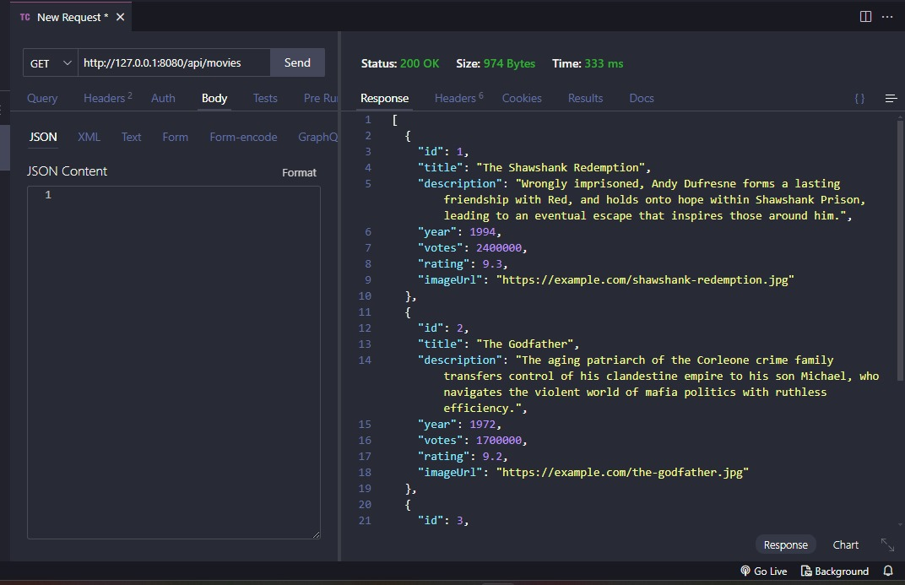

# APIREST-SpringBoot



Creación de mi primera API hecho con Java con Spring Boot JPA-Hibernate  

## Movie API - Spring Boot Application

This project provides a RESTful API for managing movies. It includes the ability to list, retrieve, create, update, delete, and rate movies. The API is built using **Spring Boot** and leverages common Spring frameworks like **Spring Data JPA** for data persistence.

## Table of Contents

- [Features](#features)
- [Endpoints](#endpoints)
- [Dependencies](#dependencies)
- [Installation](#installation)
- [Usage](#usage)
- [License](#license)
- [Images](#images)

## Features 

## Endpoints

### 2. Obtener Película por ID

- **Método**: `GET`
- **URL**: `/api/movies/{id}`

  Recupera los detalles de una película específica por su ID.

  **Respuesta**: 
  - Devuelve los detalles de la película o `404 Not Found` si no se encuentra.

---

### 4. Actualizar Película

- **Método**: `PUT`
- **URL**: `/api/movies/{id}`

  Actualiza los detalles de una película existente. El ID debe estar incluido en la URL, y los nuevos datos deben enviarse en el cuerpo de la solicitud.

  **Respuesta**: 
  - Devuelve los detalles actualizados de la película.

---

### 5. Eliminar Película

- **Método**: `DELETE`
- **URL**: `/api/movies/{id}`

  Elimina una película utilizando su ID.

  **Respuesta**:
  - **Éxito**: Devuelve `204 No Content`.
  - **Error**: Devuelve `404 Not Found` si la película no existe.

---

### 6. Calificar una Película

- **Método**: `GET`
- **URL**: `/api/movies/vote/{id}/{rating}`

  Envía una nueva calificación para la película especificada. La calificación es un valor numérico incluido en la URL.

  **Respuesta**: 
  - Devuelve la película actualizada con la nueva calificación promedio.

---

## Dependencias

El proyecto utiliza las siguientes dependencias:

- Spring Boot Starter Data JPA
- Spring Boot Starter Web
- H2 Database (para desarrollo)
- Lombok (opcional)


- **List all movies**: Retrieve all movies stored in the database.
- **Get movie by ID**: Retrieve details for a specific movie by its ID.
- **Add a new movie**: Create and save a new movie to the database.
- **Update movie**: Modify an existing movie.
- **Delete movie**: Remove a movie by its ID.
- **Rate a movie**: Submit a rating for a movie, which will update its overall rating.

## Endpoints

### List All Movies

- **Method**: `GET`
- **URL**: `/api/movies`
  
  Retrieves a list of all available movies.
  
  **Response**:
  ```json
  [
    {
      "id": 1,
      "title": "The Shawshank Redemption",
      "description": "Wrongly imprisoned, Andy Dufresne forms a lasting friendship...",
      "year": 1994,
      "votes": 2400000,
      "rating": 9.3
    },
    ...
  ]


